# IntelliMap Smart Service Plug-In

[](https://github.com/your-org/intellimapsmartservice)
[](https://www.oracle.com/java/)
[](https://appian.com/)
[](LICENSE)

An enterprise-grade Appian Smart Service plug-in specialized for **intelligent data mapping** using Azure OpenAI services. This plugin provides a single specialized smart service, **IntelliMap**, which transforms unstructured data into standardized formats with confidence scoring and comprehensive error handling.

> **🏷️ Industry Focus**: This plugin is specifically designed for the **data processing**. It contains only one smart service: `IntelliMap`, which specializes in mapping data to standardized industry field formats.

## 📋 Table of Contents

- [Overview](#overview)
- [Key Features](#key-features)
- [Smart Service](#smart-service)
- [Quick Start](#quick-start)
- [Installation](#installation)
- [Configuration](#configuration)
- [Usage Examples](#usage-examples)
- [API Reference](#api-reference)
- [Architecture](#architecture)
- [Error Handling](#error-handling)
- [Performance & Security](#performance--security)
- [Troubleshooting](#troubleshooting)
- [Deployment Guide](#deployment-guide)
- [Version History](#version-history)
- [Contributing](#contributing)
- [Support](#support)

## 🎯 Overview

The IntelliMap Smart Service leverages Azure OpenAI's advanced natural language processing to intelligently analyze, understand, and map **data** to standardized industry formats. This specialized plugin provides enterprise-ready data transformation capabilities specifically designed for the **general** workflow and business processes.

### Why Choose IntelliMap?

- 🤖 **AI-Powered Intelligence**: Utilizes Azure OpenAI for sophisticated data understanding
- 📊 **Confidence Scoring**: Each mapping includes confidence levels for quality assurance
- ⚡ **Enterprise-Ready**: Built-in rate limiting, retry logic, and robust error handling
- 🔧 **Highly Configurable**: Customizable prompts, field mappings, and processing parameters
- 🌍 **Internationalization**: Multi-language support for global deployments
- 📈 **Production-Tested**: Comprehensive logging and monitoring capabilities

## ✨ Key Features

### 🎯 Intelligent Mapping
- **Natural Language Processing**: Advanced AI understanding of data relationships
- **Semantic Field Matching**: Intelligent matching beyond simple keyword matching
- **Contextual Analysis**: Considers data context for more accurate mappings
- **Custom Prompt Support**: Tailor AI instructions for specific use cases

### 🔒 Enterprise Security & Reliability
- **Rate Limiting**: Sliding window algorithm with configurable limits
- **Retry Logic**: Exponential backoff with intelligent failure handling
- **Input Validation**: Comprehensive sanitization and validation
- **Secure Credential Handling**: Safe management of API keys and sensitive data

### 📊 Quality Assurance
- **Confidence Scoring**: Individual confidence ratings (0-100) for each mapping
- **Comprehensive Logging**: Multi-level logging with performance metrics
- **Error Recovery**: Graceful handling of API failures and malformed data
- **Audit Trail**: Complete tracking of all mapping operations

### 🛠️ Developer Experience
- **Jackson JSON Integration**: Robust JSON parsing and generation
- **Internationalization**: Resource bundles for multi-language support
- **Configuration Management**: Centralized, environment-specific settings
- **Extensive Documentation**: Complete API reference and examples

## 🚀 Smart Service

This plugin provides one specialized smart service:

### IntelliMap

**Purpose**: Specialized mapping for general order data to canonical business fields.

**Key Capabilities**:
- Maps raw order data to 106+ standardized standardized fields
- Industry-specific semantic understanding
- Comprehensive coverage of business processes
- Support for complex product hierarchies and business rules

**Standardized Field Categories**:
- 🏷️ **Product Information** (F-series): Style, color, material, sizing
- 📦 **Order Details** (O-series): PO numbers, quantities, delivery dates
- 👤 **Customer Data** (C-series): Departments, regions, preferences  
- 📍 **Location Data** (L-series): Shipping, distribution, warehouses
- 💰 **Pricing** (P-series): FOB pricing, cost structures
- 📊 **Quantities** (S-series): Order quantities, tolerances

**Ideal For**:
- general data processing
- Supply chain data standardization
- ERP system integrations
- B2B order management

## ⚡ Quick Start

### Prerequisites
- Appian 24.2+ environment
- Azure OpenAI service with deployed model
- Java 8+ runtime
- Required JAR dependencies (see [Installation](#installation))

### Basic Setup

1. **Download and Install**
   ```bash
   # Download the plugin JAR
   wget https://releases.your-domain.com/intellimapsmartservice-v4.0.0.jar
   
   # Install in Appian Admin Console
   # Navigate to Plug-ins → Install Plug-in
   ```

2. **Configure Azure OpenAI**
   ```javascript
   // In Appian Process Model or Interface
   azureEndpoint: "https://your-resource.openai.azure.com/"
   azureApiKey: "your-32-character-api-key"
   deploymentName: "deployment-name"
   apiVersion: "llm-model-version"
   ```

3. **Test Basic Mapping**
   ```javascript
   // Simple IntelliMap example
   IntelliMap(
     inputRecords: {
        {'*DOC_ID': "IMP00265771", '*LINE#': "1", 'Style Description': "HIPSTER", Color: "UB1", 'Color Name': "BLACK"}, 
        {'*DOC_ID': "IMP00265771", '*LINE#': "2", 'Style Description': "HIPSTER", Color: "UB1", 'Color Name': "BLACK"}
      },
     azureOpenAIEndpoint: cons!AZURE_OPENAI_ENDPOINT,
     azureOpenAIKey: cons!AZURE_OPENAI_KEY,
     azureOpenAIDeploymentName: cons!DEPLOYMENT_NAME,
     azureOpenAIApiVersion: cons!API_VERSION,
     targetFields: {"customer_id", "color"},
     userPrompt: "Map data to standard fields"
   )
   ```

## 🔧 Installation

### Step 1: Download Dependencies

Download the required JAR files and place them in `src/META-INF/lib/`:

| Dependency | Version | Download Link |
|------------|---------|---------------|
| Jackson Core | 2.15.2 | [Maven Central](https://mvnrepository.com/artifact/com.fasterxml.jackson.core/jackson-core/2.15.2) |
| Jackson Databind | 2.15.2 | [Maven Central](https://mvnrepository.com/artifact/com.fasterxml.jackson.core/jackson-databind/2.15.2) |
| Jackson Annotations | 2.15.2 | [Maven Central](https://mvnrepository.com/artifact/com.fasterxml.jackson.core/jackson-annotations/2.15.2) |

### Step 2: Directory Structure
```
intellimapsmartservice/
├── src/
│   ├── appian-plugin.xml
│   ├── META-INF/
│   │   └── lib/
│   │       ├── jackson-core-2.15.2.jar
│   │       ├── jackson-databind-2.15.2.jar
│   │       └── jackson-annotations-2.15.2.jar
│   └── com/lcm/plugins/intellimapsmartservice/
│       ├── IntelliMap.java
│       ├── IntelliMapConfig.java
└──     └── RateLimiter.java
```

### Step 3: Build and Deploy
```bash
# Compile the project
javac -cp "lib/*:appian-plug-in-sdk.jar" src/com/lcm/plugins/intellimapsmartservice/*.java -d bin/

# Package as JAR
jar -cvf intellimapsmartservice-v4.0.0.jar -C bin/ .

# Deploy to Appian (via Admin Console)
```

## ⚙️ Configuration

### Environment Configuration

Create configuration constants in Appian:

```javascript
// Rate Limiting Configuration
cons!MAX_REQUESTS_PER_MINUTE: 60
cons!MAX_REQUESTS_PER_HOUR: 1000
cons!RATE_LIMIT_DELAY_MS: 1000

// Retry Configuration
cons!MAX_RETRIES: 3
cons!REQUEST_TIMEOUT_SECONDS: 30
cons!ENABLE_DEBUG_LOGGING: false
```

### Advanced Configuration Options

#### Rate Limiting Settings
```java
// In IntelliMapConfig.java
public static final int MAX_REQUESTS_PER_MINUTE = 60;
public static final int MAX_REQUESTS_PER_HOUR = 1000;
public static final Duration RATE_LIMIT_DELAY = Duration.ofMillis(1000);
public static final boolean ENABLE_RATE_LIMITING = true;
```

#### Retry and Timeout Settings
```java
public static final int MAX_RETRIES = 3;
public static final Duration DEFAULT_TIMEOUT = Duration.ofSeconds(30);
public static final Duration RETRY_BASE_DELAY = Duration.ofSeconds(1);
public static final double RETRY_MULTIPLIER = 2.0;
```

#### Logging Configuration
```java
public static final boolean ENABLE_DEBUG_LOGGING = false;
public static final boolean ENABLE_PERFORMANCE_LOGGING = true;
public static final String LOGGER_NAME = "com.lcm.intellimapsmartservice";
```

## 📝 Usage Examples

### IntelliMap - Basic Example

```javascript
=IntelliMap(
  inputRecords: {
        {'*DOC_ID': "IMP00265771", '*LINE#': "1", 'Style Description': "HIPSTER", Color: "UB1", 'Color Name': "BLACK"}, 
        {'*DOC_ID': "IMP00265883", '*LINE#': "2", 'Style Description': "HIPSTER", Color: "UB1", 'Color Name': "BLACK"}
      },
  azureOpenAIEndpoint: cons!AZURE_OPENAI_ENDPOINT,
  azureOpenAIKey: cons!AZURE_OPENAI_KEY,
  azureOpenAIDeploymentName: cons!AZURE_OPENAI_DEPLOYMENT,
  azureOpenAIApiVersion: cons!AZURE_OPENAI_API_VERSION,
  targetFields: {"customer_id", "color"},
  userPrompt: "Map this data to standard industry fields. Focus on accurate style and quantity information."
)

/* Expected Output Structure */
{
  mappedResult: [
    {
      customer_id: "IMP00265771",
      color: "BLACK"
    },
    {
      customer_id: "IMP00265883",
      color: "BLACK"
    }
    /* ... additional mappings ... */
  ],
  overallConfidence: 0.89
}
```

#### Error Handling Example
```javascript
/* Robust error handling pattern */
a!try(
  IntelliMap(
    inputRecords: ri!inputData,
    azureOpenAIEndpoint: cons!AZURE_OPENAI_ENDPOINT,
    azureOpenAIKey: cons!AZURE_OPENAI_KEY,
    azureOpenAIDeploymentName: cons!AZURE_OPENAI_DEPLOYMENT,
    azureOpenAIApiVersion: cons!AZURE_OPENAI_API_VERSION,
    targetFields: ri!targetFields,
    userPrompt: ri!mappingPrompt
  ),
  a!catch(
    error: {
      success: false,
      errorMessage: "Data mapping failed: " & fv!error.message,
      fallbackData: ri!inputData
    }
  )
)
```

## 📚 API Reference

### IntelliMap

#### Input Parameters  

| Parameter | Type | Required | Description | Example |
|-----------|------|----------|-------------|---------|
| `inputRecords` | TypedValue | ✅ | Raw data | Appian Dictionary |
| `azureOpenAIEndpoint` | String | ✅ | Azure OpenAI service URL | `"https://resource.openai.azure.com/"` |
| `azureOpenAIKey` | String | ✅ | API authentication key | `"abc123...xyz789"` |
| `azureOpenAIDeploymentName` | String | ✅ | Model deployment name | `"gpt-4-deployment"` |
| `azureOpenAIApiVersion` | String | ✅ | Azure OpenAI API version | `"2023-05-15"` |
| `targetFields` | TypedValue | ✅ | List of target field mappings | Text List |
| `userPrompt` | String | ✅ | Custom mapping instructions | Custom prompt string |

#### Output Parameters

| Parameter | Type | Description |
|-----------|------|-------------|
| `mappedResult` | String | JSON array of mapped fields with confidence scores |
| `overallConfidence` | Double | Overall mapping confidence (0.0-1.0) |

## 🏗️ Architecture

### 1. High-Level System Architecture

```mermaid

graph TB
    %% External Systems
    subgraph "External Systems"
        APPIAN[Appian Platform<br/>Process Models & Interfaces]
        AZURE[Azure OpenAI Service<br/>GPT-4/GPT-3.5 Models]
    end

    %% Plugin Core - CORRECTED to show only one smart service
    subgraph "IntelliMap Smart Service Plugin v4.0.0"
        subgraph "Smart Service Layer"
            AOM[IntelliMap<br/>IntelliMap.java<br/>Single Smart Service Implementation]
        end
        
        subgraph "Core Components"
            CONFIG[Configuration Manager<br/>IntelliMapConfig.java]
            RATE[Rate Limiter<br/>RateLimiter.java<br/>Sliding Window Algorithm]
            JSON[JSON Processor<br/>Jackson Libraries]
        end
        
        subgraph "Internationalization"
            I18N_DEFAULT[intellimap-v4.properties<br/>Default Locale Messages]
            I18N_EN[intellimap-v4_en_US.properties<br/>English US Messages]
        end
        
        subgraph "Processing Pipeline"
            VALIDATE[Input Validation<br/>& Sanitization]
            PARSE[Data Parser<br/>Multiple Format Support]
            CHUNK[Chunking Engine<br/>Large Input Handling]
            RETRY[Retry Logic<br/>Exponential Backoff]
            CONFIDENCE[Confidence Calculator<br/>Quality Scoring]
        end
    end

    %% Build Artifacts
    subgraph "Build Output"
        JAR[intellimapsmartservice-v4.0.0.jar<br/>32MB Final Plugin<br/>Single Deployable Artifact]
        CLASSES[Compiled Classes<br/>IntelliMap.class<br/>IntelliMapConfig.class<br/>RateLimiter.class]
    end

    %% Data Flow - Input Processing
    APPIAN -->|Process Input Data| AOM
    
    AOM --> VALIDATE
    VALIDATE --> PARSE
    PARSE -->|Large Input| CHUNK
    PARSE -->|Regular Input| RATE
    CHUNK --> RATE
    
    %% Configuration and Dependencies
    CONFIG -.->|Configuration Values| AOM
    CONFIG -.->|Rate Limits & Timeouts| RATE
    CONFIG -.->|JSON Settings| JSON
    I18N_DEFAULT -.->|Error Messages & Labels| AOM
    I18N_EN -.->|Localized Messages| AOM
    
    RATE -->|Rate Check Passed| RETRY
    
    %% External API Integration
    RETRY -->|HTTP Request<br/>with API Key| AZURE
    AZURE -->|JSON Response| JSON
    
    %% Response Processing
    JSON --> CONFIDENCE
    CONFIDENCE --> AOM
    
    %% Output
    AOM -->|mappedResult JSON Array<br/>overallConfidence Score| APPIAN

    %% Build Process
    AOM --> CLASSES
    CONFIG --> CLASSES
    RATE --> CLASSES
    I18N_DEFAULT --> CLASSES
    I18N_EN --> CLASSES
    CLASSES --> JAR

    %% Data Formats & Protocols
    subgraph "Supported Input Formats"
        FORMATS["• Data Dictionary Format<br/>• JSON Objects/Arrays<br/>• Custom Delimited Format<br/>• Map Collections"]
    end
    
    subgraph "Output Standards"
        OUTPUT["• JSON Array of Mapped Fields<br/>• Individual Confidence Scores<br/>• Overall Confidence Rating<br/>• Error Handling & Logging"]
    end
    
    %% Dependencies
    subgraph "External Dependencies"
        JACKSON["Jackson JSON Libraries<br/>• jackson-core-2.15.2<br/>• jackson-databind-2.15.2<br/>• jackson-annotations-2.15.2"]
        SDK["Appian Plugin SDK<br/>Smart Service Framework"]
    end
    
    %% Technical Specifications
    subgraph "Technical Details"
        SPECS["• Java 8+ Runtime<br/>• Thread-Safe Operations<br/>• Concurrent Request Handling<br/>• Memory-Efficient Processing<br/>• Multi-Language Support (i18n)"]
    end

    %% Styling
    classDef external fill:#e1f5fe,stroke:#01579b,stroke-width:2px,color:#000
    classDef plugin fill:#f3e5f5,stroke:#4a148c,stroke-width:2px,color:#000
    classDef core fill:#fff3e0,stroke:#e65100,stroke-width:2px,color:#000
    classDef process fill:#e8f5e8,stroke:#2e7d32,stroke-width:2px,color:#000
    classDef data fill:#fff8e1,stroke:#f57f17,stroke-width:2px,color:#000
    classDef i18n fill:#fce4ec,stroke:#c2185b,stroke-width:2px,color:#000
    classDef build fill:#f1f8e9,stroke:#689f38,stroke-width:2px,color:#000
    
    class APPIAN,AZURE external
    class AOM,CONFIG,RATE,JSON plugin
    class VALIDATE,PARSE,CHUNK,RETRY,CONFIDENCE process
    class FORMATS,OUTPUT,JACKSON,SDK,SPECS data
    class I18N_DEFAULT,I18N_EN i18n
    class JAR,CLASSES build
```



### 2. High-Level Process Flow

```mermaid
flowchart TD
    %% Start
    START([🚀 Appian Process Model<br/>Initiates IntelliMap])
    
    %% Main Processing Steps
    INPUT[📥 Receive Input Data<br/>• data records<br/>• Target field mappings<br/>• Azure OpenAI credentials]
    
    VALIDATE[✅ Validate & Parse<br/>• Check required parameters<br/>• Parse input format<br/>• Sanitize data]
    
    RATE_LIMIT[⏱️ Rate Limiting<br/>• Check API limits<br/>• Apply delays if needed<br/>• 60 req/min, 1000 req/hour]
    
    AI_PROCESS[🤖 Azure OpenAI Processing<br/>• Build dynamic prompt<br/>• Send API request<br/>• GPT-4 intelligent mapping]
    
    PARSE_RESULTS[📊 Process Results<br/>• Extract mapped fields<br/>• Calculate confidence scores<br/>• Format JSON output]
    
    RETURN[📤 Return to Appian<br/>• mappedResult: JSON array<br/>• overallConfidence: score<br/>• Error handling if needed]
    
    %% End
    END([✨ Complete<br/>data Successfully Mapped])

    %% Flow connections
    START --> INPUT
    INPUT --> VALIDATE
    VALIDATE --> RATE_LIMIT
    RATE_LIMIT --> AI_PROCESS
    AI_PROCESS --> PARSE_RESULTS
    PARSE_RESULTS --> RETURN
    RETURN --> END

    %% Error handling (simplified)
    VALIDATE -.->|❌ Validation Error| ERROR[🚨 Error Response<br/>SmartServiceException]
    AI_PROCESS -.->|❌ API Error| RETRY[🔄 Retry Logic<br/>Up to 3 attempts]
    RETRY -.->|✅ Success| PARSE_RESULTS
    RETRY -.->|❌ All retries failed| ERROR
    ERROR -.-> END

    %% Styling
    classDef startEnd fill:#e8f5e8,stroke:#4caf50,stroke-width:3px,color:#000
    classDef process fill:#e3f2fd,stroke:#2196f3,stroke-width:2px,color:#000
    classDef ai fill:#fff3e0,stroke:#ff9800,stroke-width:2px,color:#000
    classDef error fill:#ffebee,stroke:#f44336,stroke-width:2px,color:#000
    
    class START,END startEnd
    class INPUT,VALIDATE,RATE_LIMIT,PARSE_RESULTS,RETURN process
    class AI_PROCESS ai
    class ERROR,RETRY error
```



### 3. Detailed Data Flow Processing


### 4. Component Dependencies & Relationships

```mermaid
graph TD
    %% Plugin Definition
    subgraph "Appian Plugin Framework"
        PLUGIN[appian-plugin.xml<br/>Plugin Configuration<br/>Version 4.0.0<br/>Single Smart Service Definition]
    end

    %% CORRECTED - Only One Smart Service
    subgraph "Smart Service Implementation"
        AOM[IntelliMap.java<br/>@AppianSmartService<br/>@PaletteInfo<br/>Only Smart Service Class<br/>1613 lines of code]
    end

    %% Core Components
    subgraph "Configuration & Utilities"
        CONFIG[IntelliMapConfig.java<br/>Static Configuration<br/>Constants & Settings<br/>56 lines]
        RATE[RateLimiter.java<br/>Thread-Safe<br/>Sliding Window Algorithm<br/>135 lines]
    end

    %% NEW - Internationalization Support
    subgraph "Internationalization Files"
        I18N_DEFAULT[intellimap-v4.properties<br/>Default Locale Messages<br/>48 lines]
        I18N_EN[intellimap-v4_en_US.properties<br/>English US Messages<br/>48 lines]
    end

    %% External Libraries
    subgraph "Jackson JSON Processing"
        MAPPER[ObjectMapper<br/>JSON Serialization/Deserialization]
        NODE[JsonNode<br/>JSON Tree Navigation]
        EXCEPTION[JsonProcessingException<br/>Error Handling]
    end

    %% HTTP Client
    subgraph "HTTP Communication"
        CLIENT[HttpClient<br/>Azure OpenAI Communication]
        REQUEST[HttpRequest<br/>API Request Building]
        RESPONSE[HttpResponse<br/>API Response Handling]
    end

    %% Data Structures
    subgraph "Data Models"
        TYPED[TypedValue<br/>Appian Input Parameters]
        MAP[HashMap & ConcurrentHashMap<br/>Data Storage & Thread Safety]
        LIST[ArrayList<br/>Record Collections]
        STRING[String<br/>JSON & Text Processing]
    end

    %% UPDATED - Actual Methods from Code
    subgraph "Core Processing Methods"
        VALIDATE[validateInputs<br/>7 Parameter Validation]
        PARSE_MULTI[parseMultipleRecordsFromAppianFormat<br/>Multiple Record Support]
        PARSE_SINGLE[parseCustomDelimitedFormat<br/>Single Record Parsing]
        CHUNK[processChunkedInput<br/>Large Input Handling]
        AZURE[callAzureOpenAIWithRetry<br/>API Integration with Retry]
        CONFIDENCE[calculateOverallConfidence<br/>Quality Assessment]
        BUILD_PROMPT[buildSystemPrompt<br/>Dynamic Prompt Generation]
    end

    %% CORRECTED - Build Output
    subgraph "Build Artifacts"
        CLASSES[Compiled Classes<br/>IntelliMap.class: 40KB<br/>IntelliMapConfig.class: 1.8KB<br/>RateLimiter.class: 6.1KB]
        JAR[intellimapsmartservice-v4.0.0.jar<br/>32MB Final Plugin<br/>Single Deployable Artifact]
    end

    %% Dependencies and Relationships
    PLUGIN --> AOM
    
    AOM --> CONFIG
    AOM --> RATE
    AOM --> MAPPER
    AOM --> CLIENT
    AOM --> TYPED
    AOM --> I18N_DEFAULT
    AOM --> I18N_EN
    
    CONFIG -.->|Provides Settings| VALIDATE
    CONFIG -.->|Rate Limits| RATE
    CONFIG -.->|Timeouts| CLIENT
    CONFIG -.->|Token Limits| BUILD_PROMPT
    
    I18N_DEFAULT -.->|Error Messages| VALIDATE
    I18N_EN -.->|Localized Messages| VALIDATE
    
    RATE --> |Thread Safety| MAP
    RATE --> |Time Management| STRING
    
    MAPPER --> NODE
    MAPPER --> EXCEPTION
    
    CLIENT --> REQUEST
    CLIENT --> RESPONSE
    
    %% Method Dependencies
    AOM --> VALIDATE
    AOM --> PARSE_MULTI
    AOM --> PARSE_SINGLE
    AOM --> CHUNK
    AOM --> AZURE
    AOM --> CONFIDENCE
    AOM --> BUILD_PROMPT
    
    VALIDATE --> TYPED
    PARSE_MULTI --> STRING
    PARSE_MULTI --> MAP
    PARSE_SINGLE --> MAP
    CHUNK --> LIST
    AZURE --> CLIENT
    AZURE --> RATE
    CONFIDENCE --> NODE
    BUILD_PROMPT --> CONFIG

    %% External System Integration
    subgraph "External Systems"
        APPIAN_PLATFORM[Appian Platform<br/>Process Models<br/>Smart Service Framework]
        AZURE_AI[Azure OpenAI Service<br/>GPT Models<br/>REST API]
    end

    APPIAN_PLATFORM --> TYPED
    AZURE --> AZURE_AI

    %% Build Process
    AOM --> CLASSES
    CONFIG --> CLASSES
    RATE --> CLASSES
    I18N_DEFAULT --> CLASSES
    I18N_EN --> CLASSES
    CLASSES --> JAR

    %% Configuration Details - UPDATED with actual values
    subgraph "Configuration Constants"
        TIMEOUTS["• DEFAULT_TIMEOUT: 30s<br/>• RATE_LIMIT_DELAY: 1s<br/>• MAX_RETRIES: 3"]
        LIMITS["• MAX_TOKENS: 8192<br/>• MAX_REQUESTS_PER_MINUTE: 60<br/>• MAX_CHUNKS_PER_REQUEST: 5<br/>• MAX_INPUT_KEYS_PER_CHUNK: 50"]
        API_SETTINGS["• TEMPERATURE: 0.1<br/>• CONTENT_TYPE_JSON<br/>• API_KEY_HEADER<br/>• DEFAULT_ENCODING: UTF-8"]
    end

    CONFIG --> TIMEOUTS
    CONFIG --> LIMITS
    CONFIG --> API_SETTINGS

    %% Styling
    classDef plugin fill:#e8eaf6,stroke:#3f51b5,stroke-width:2px,color:#000
    classDef service fill:#f3e5f5,stroke:#7b1fa2,stroke-width:2px,color:#000
    classDef core fill:#fff3e0,stroke:#f57c00,stroke-width:2px,color:#000
    classDef i18n fill:#fce4ec,stroke:#c2185b,stroke-width:2px,color:#000
    classDef jackson fill:#e8f5e8,stroke:#388e3c,stroke-width:2px,color:#000
    classDef http fill:#e1f5fe,stroke:#0288d1,stroke-width:2px,color:#000
    classDef data fill:#fff8e1,stroke:#fbc02d,stroke-width:2px,color:#000
    classDef methods fill:#e3f2fd,stroke:#1976d2,stroke-width:2px,color:#000
    classDef external fill:#f1f8e9,stroke:#689f38,stroke-width:2px,color:#000
    classDef config fill:#fff3e0,stroke:#ff8f00,stroke-width:1px,color:#000
    classDef build fill:#f9fbe7,stroke:#827717,stroke-width:2px,color:#000

    class PLUGIN plugin
    class AOM service
    class CONFIG,RATE core
    class I18N_DEFAULT,I18N_EN i18n
    class MAPPER,NODE,EXCEPTION jackson
    class CLIENT,REQUEST,RESPONSE http
    class TYPED,MAP,LIST,STRING data
    class VALIDATE,PARSE_MULTI,PARSE_SINGLE,CHUNK,AZURE,CONFIDENCE,BUILD_PROMPT methods
    class APPIAN_PLATFORM,AZURE_AI external
    class TIMEOUTS,LIMITS,API_SETTINGS config
    class CLASSES,JAR build
```

### Component Overview

#### Core Components

**IntelliMap.java**  
- **Only smart service implementation** in the plugin
- Specialized for general order data mapping
- Industry-specific field mappings and semantic understanding
- Support for 106+ standardized fields
- Advanced confidence scoring and error handling
- Manages Azure OpenAI API integration with retry logic

**IntelliMapConfig.java**
- Centralized configuration management
- Environment-specific settings
- Runtime configuration parameters
- Constants and defaults

**RateLimiter.java**
- Sliding window rate limiting algorithm
- Thread-safe implementation 
- Configurable limits (per minute/hour)
- Automatic cleanup of expired entries

#### Supporting Infrastructure

**Internationalization Support**
- `intellimap.properties` - Default locale messages
- `intellimap_en_US.properties` - English US messages
- Localized error messages and parameter descriptions
- Multi-language support for global deployments

**Logging Framework**
- Structured logging with multiple levels
- Performance metrics and monitoring
- Debug mode for troubleshooting
- Audit trail capabilities

**JSON Processing**
- Jackson library integration
- Type-safe JSON operations
- Robust parsing with error recovery
- Optimal performance

### Data Flow

1. **Input Processing**
   - Validate input parameters
   - Sanitize data for security
   - Format for Azure OpenAI API

2. **Rate Limiting**
   - Check current request rate
   - Apply delays if necessary  
   - Update request counters

3. **API Communication**
   - Construct Azure OpenAI request
   - Execute with timeout handling
   - Implement retry logic on failures

4. **Response Processing**
   - Parse JSON response with Jackson
   - Extract mapped data and confidence scores
   - Validate response structure

5. **Output Generation**
   - Format mapped results
   - Calculate overall confidence
   - Return structured response

## 🚨 Error Handling

### Error Categories

#### Input Validation Errors
```java
// Missing required parameters
MISSING_REQUIRED_PARAMETER("Required parameter {0} is missing or null")

// Invalid data formats  
INVALID_INPUT_FORMAT("Input data format is invalid: {0}")

// Parameter validation failures
PARAMETER_VALIDATION_FAILED("Parameter validation failed for {0}: {1}")
```

#### API Communication Errors
```java
// Authentication failures
AZURE_AUTHENTICATION_FAILED("Azure OpenAI authentication failed")

// Network connectivity issues
NETWORK_CONNECTION_ERROR("Network connection error: {0}")

// API quota exceeded
RATE_LIMIT_EXCEEDED("API rate limit exceeded. Retry after: {0}")

// Service unavailable
AZURE_SERVICE_UNAVAILABLE("Azure OpenAI service temporarily unavailable")
```

#### Processing Errors
```java
// JSON parsing failures
JSON_PARSING_ERROR("Failed to parse JSON response: {0}")

// Invalid response format
INVALID_RESPONSE_FORMAT("Azure OpenAI response format is invalid")

// Mapping failures
MAPPING_OPERATION_FAILED("Data mapping operation failed: {0}")
```

### Error Recovery Strategies

#### Automatic Retry Logic
```java
public class RetryConfig {
    public static final int MAX_RETRIES = 3;
    public static final Duration BASE_DELAY = Duration.ofSeconds(1);
    public static final double BACKOFF_MULTIPLIER = 2.0;
    
    // Exponential backoff: 1s, 2s, 4s
    public static Duration calculateDelay(int retryAttempt) {
        return BASE_DELAY.multipliedBy((long) Math.pow(BACKOFF_MULTIPLIER, retryAttempt));
    }
}
```

#### Graceful Degradation
- **Partial Results**: Return successfully mapped fields even if some fail
- **Fallback Values**: Use default mappings when AI processing fails  
- **Error Context**: Provide detailed error information for debugging
- **Recovery Options**: Suggest alternative approaches or manual intervention

#### Error Logging and Monitoring
```java
// Structured error logging
logger.error("Mapping operation failed", 
    Map.of(
        "operation", "IntelliMapSmartService",
        "customerId", customerId,
        "errorCode", errorCode,
        "retryAttempt", retryCount,
        "processingTime", processingTime
    )
);
```

### Best Practices for Error Handling

1. **Always Use Try-Catch**: Wrap smart service calls in error handling
2. **Check Confidence Scores**: Validate mapping quality before processing
3. **Implement Timeouts**: Set reasonable timeout values for API calls
4. **Log Errors Appropriately**: Use structured logging for debugging
5. **Provide Fallbacks**: Have alternative processing paths ready
6. **Monitor Rate Limits**: Track API usage to prevent quota issues

## 🔒 Performance & Security

### Performance Optimization

#### Connection Management
```java
// HTTP client configuration
HttpClient client = HttpClient.newBuilder()
    .connectTimeout(Duration.ofSeconds(10))
    .executor(Executors.newFixedThreadPool(5))
    .build();
```

#### Memory Management
- **Connection Pooling**: Reuse HTTP connections for efficiency
- **Rate Limit Cleanup**: Automatic removal of expired rate limit entries
- **JSON Streaming**: Process large responses without full memory loading
- **Garbage Collection**: Optimize object creation and cleanup

#### Caching Strategies
```java
// Configuration caching
private static final Map<String, Object> configCache = new ConcurrentHashMap<>();

// Response caching for duplicate requests (optional)
private static final Cache<String, String> responseCache = 
    CacheBuilder.newBuilder()
        .expireAfterWrite(5, TimeUnit.MINUTES)
        .maximumSize(1000)
        .build();
```

### Security Measures

#### API Key Protection
- **Secure Storage**: API keys stored in Appian secure constants
- **Transmission Security**: HTTPS-only communication
- **Key Rotation**: Support for regular API key updates
- **Access Control**: Restricted access to configuration constants

#### Input Sanitization
```java
// Input validation and sanitization
public String sanitizeInput(String input) {
    if (input == null) return null;
    
    // Remove potentially dangerous characters
    String sanitized = input.replaceAll("[<>\"'&]", "");
    
    // Limit length to prevent DoS attacks
    if (sanitized.length() > MAX_INPUT_LENGTH) {
        sanitized = sanitized.substring(0, MAX_INPUT_LENGTH);
    }
    
    return sanitized;
}
```

#### Rate Limiting Security
- **DoS Protection**: Prevents abuse through request limiting
- **IP-based Limiting**: Optional IP-based rate limiting
- **Quota Management**: Prevents accidental API quota exhaustion
- **Monitoring**: Track unusual usage patterns

#### Data Privacy
- **No Data Persistence**: Input data not stored permanently
- **Logging Controls**: Configurable logging levels for sensitive data
- **Audit Trails**: Complete tracking of data processing operations
- **Compliance**: GDPR and CCPA compliant data handling

### Performance Monitoring

#### Key Metrics
```java
// Performance metrics to monitor
- API Response Time (avg/p95/p99)
- Request Success Rate
- Rate Limit Utilization  
- Memory Usage
- Error Rates by Category
- Confidence Score Distribution
```

#### Logging Performance Data
```java
logger.info("Performance metrics", 
    Map.of(
        "operation", operationType,
        "responseTimeMs", responseTime,
        "confidenceScore", confidence,
        "inputSizeKb", inputSize / 1024,
        "outputSizeKb", outputSize / 1024,
        "retryCount", retries
    )
);
```

## 🔧 Troubleshooting

### Common Issues and Solutions

#### 1. Missing JAR Dependencies
**Symptoms**: ClassNotFoundException, NoClassDefFoundError
```bash
# Error example
java.lang.ClassNotFoundException: com.fasterxml.jackson.databind.ObjectMapper
```
**Solution**: 
```bash
# Verify JAR files exist in correct location
ls -la src/META-INF/lib/
# Should show:
# jackson-core-2.15.2.jar
# jackson-databind-2.15.2.jar  
# jackson-annotations-2.15.2.jar

# Download missing JARs if needed
wget https://repo1.maven.org/maven2/com/fasterxml/jackson/core/jackson-core/2.15.2/jackson-core-2.15.2.jar
```

#### 2. Azure OpenAI Authentication Failures
**Symptoms**: 401 Unauthorized, 403 Forbidden responses
```json
{
  "error": {
    "code": "InvalidAuthenticationToken",
    "message": "The access token is invalid"
  }
}
```
**Solution**:
```javascript
// Verify credentials in Appian constants
cons!AZURE_OPENAI_KEY // Should be 32-character string
cons!AZURE_OPENAI_ENDPOINT // Should end with trailing slash
cons!AZURE_OPENAI_DEPLOYMENT // Should match deployed model name

// Test with minimal request
curl -X POST "https://your-resource.openai.azure.com/openai/deployments/your-deployment/completions?api-version=2023-05-15" \
  -H "api-key: YOUR_API_KEY" \
  -H "Content-Type: application/json"
```

#### 3. Rate Limiting Issues
**Symptoms**: 429 Too Many Requests, slow processing
```json
{
  "error": {
    "code": "TooManyRequests", 
    "message": "Rate limit exceeded"
  }
}
```
**Solution**:
```java
// Adjust rate limits in IntelliMapConfig.java
public static final int MAX_REQUESTS_PER_MINUTE = 30; // Reduce from 60
public static final int MAX_REQUESTS_PER_HOUR = 500;  // Reduce from 1000
public static final Duration RATE_LIMIT_DELAY = Duration.ofMillis(2000); // Increase delay
```

#### 4. JSON Parsing Errors
**Symptoms**: JsonProcessingException, malformed response errors
```bash
# Error example
com.fasterxml.jackson.core.JsonParseException: Unexpected character
```
**Solution**:
```java
// Enable debug logging to see raw responses
public static final boolean ENABLE_DEBUG_LOGGING = true;

// Check Azure OpenAI response format
// Ensure deployment returns valid JSON
// Verify prompt instructions request JSON output
```

#### 5. Timeout Issues
**Symptoms**: SocketTimeoutException, slow responses
```bash
# Error example  
java.net.SocketTimeoutException: Read timed out
```
**Solution**:
```java
// Increase timeout values
public static final Duration DEFAULT_TIMEOUT = Duration.ofSeconds(60); // Increase from 30
public static final Duration CONNECTION_TIMEOUT = Duration.ofSeconds(20);

// Monitor Azure OpenAI service status
// Consider model performance (GPT-4 vs GPT-3.5)
```

#### 6. Memory Issues
**Symptoms**: OutOfMemoryError, heap space errors
```bash
# Error example
java.lang.OutOfMemoryError: Java heap space
```
**Solution**:
```java
// Limit input data size
public static final int MAX_INPUT_SIZE = 50000; // 50KB limit

// Process data in batches
// Use streaming JSON parsing for large responses
// Monitor memory usage in Appian Admin Console
```

### Debug Mode Configuration

#### Enable Debug Logging
```java
// In IntelliMapConfig.java
public static final boolean ENABLE_DEBUG_LOGGING = true;
public static final boolean ENABLE_PERFORMANCE_LOGGING = true;
public static final boolean LOG_API_REQUESTS = true; // Careful with sensitive data
public static final boolean LOG_API_RESPONSES = true; // Careful with sensitive data
```

#### Debug Output Examples
```bash
# Input validation debug
DEBUG [IntelliMapSmartService] Input validation passed: customerData size=1.2KB

# Rate limiting debug  
DEBUG [RateLimiter] Current rate: 45 requests/minute, 890 requests/hour

# API request debug
DEBUG [IntelliMapSmartService] Sending request to Azure OpenAI: endpoint=https://resource.openai.azure.com

# Response processing debug
DEBUG [IntelliMapSmartService] Received response: size=2.1KB, processingTime=1.2s

# Confidence calculation debug
DEBUG [IntelliMapSmartService] Confidence scores: field1=95%, field2=87%, overall=91%
```

### Monitoring and Alerting

#### Key Metrics to Monitor
```javascript
// Success rate (should be > 95%)
successRate = successfulRequests / totalRequests

// Average response time (should be < 5s)
avgResponseTime = totalResponseTime / requestCount  

// Error rate by category
authErrors, networkErrors, parsingErrors, rateLimitErrors

// Confidence score distribution
avgConfidence, lowConfidenceAlerts (<70%)

// Resource utilization
memoryUsage, cpuUsage, diskUsage
```

#### Alert Conditions
```javascript
// Critical alerts
- Success rate < 90% for 5+ minutes
- Average response time > 10s for 5+ minutes  
- Authentication errors > 5% of requests

// Warning alerts  
- Success rate < 95% for 10+ minutes
- Average confidence < 80% for 30+ minutes
- Rate limit utilization > 80%
```

### Performance Tuning

#### Optimal Configuration
```java
// Balanced performance configuration
public static final int MAX_REQUESTS_PER_MINUTE = 45;
public static final int MAX_REQUESTS_PER_HOUR = 800;
public static final Duration DEFAULT_TIMEOUT = Duration.ofSeconds(45);
public static final int MAX_RETRIES = 2;
public static final Duration RATE_LIMIT_DELAY = Duration.ofMillis(1500);
```

#### Load Testing Recommendations
```bash
# Test with realistic data volumes
# Simulate concurrent users (5-10 simultaneous requests)
# Monitor resource usage during peak loads
# Test error scenarios and recovery
# Validate timeout and retry behavior
```

## 🚀 Deployment Guide

### Pre-Deployment Checklist

#### Environment Prerequisites
- [ ] Appian 23.1+ environment with plug-in support
- [ ] Azure OpenAI service provisioned and configured
- [ ] GPT-4 or GPT-3.5-turbo model deployed
- [ ] Network connectivity to Azure OpenAI endpoints
- [ ] Sufficient API quota allocated

#### Required Files and Dependencies
- [ ] `intellimapsmartservice-v4.0.0.jar` (compiled plug-in)
- [ ] `jackson-core-2.15.2.jar`
- [ ] `jackson-databind-2.15.2.jar`
- [ ] `jackson-annotations-2.15.2.jar`
- [ ] `appian-plugin.xml` (properly configured)

#### Configuration Constants
- [ ] `AZURE_OPENAI_ENDPOINT` constant created
- [ ] `AZURE_OPENAI_KEY` constant created (encrypted)
- [ ] `AZURE_OPENAI_DEPLOYMENT` constant created
- [ ] `AZURE_OPENAI_API_VERSION` constant created
- [ ] Optional: Rate limiting and timeout constants

### Deployment Steps

#### Step 1: Prepare the Environment
```bash
# 1. Create deployment directory
mkdir intellimap-deployment
cd intellimap-deployment

# 2. Download required JAR files
wget https://repo1.maven.org/maven2/com/fasterxml/jackson/core/jackson-core/2.15.2/jackson-core-2.15.2.jar
wget https://repo1.maven.org/maven2/com/fasterxml/jackson/core/jackson-databind/2.15.2/jackson-databind-2.15.2.jar
wget https://repo1.maven.org/maven2/com/fasterxml/jackson/core/jackson-annotations/2.15.2/jackson-annotations-2.15.2.jar

# 3. Verify JAR integrity
sha256sum jackson-*.jar
```

#### Step 2: Build the Plug-in
```bash
# 1. Compile Java sources
javac -cp "lib/*:appian-plug-in-sdk.jar" src/com/lcm/plugins/intellimapsmartservice/*.java -d bin/

# 2. Copy resources
cp src/com/lcm/plugins/intellimapsmartservice/*.properties bin/com/lcm/plugins/intellimapsmartservice/
cp src/appian-plugin.xml bin/
cp -r src/META-INF bin/

# 3. Create JAR file
cd bin
jar -cvf ../intellimapsmartservice-v4.0.0.jar *
cd ..

# 4. Verify JAR contents
jar -tf intellimapsmartservice-v4.0.0.jar | head -20
```

#### Step 3: Configure Appian Constants
```javascript
// Navigate to: Admin Console > Constants > New Constant

// Azure OpenAI Configuration
cons!AZURE_OPENAI_ENDPOINT
- Name: "Azure OpenAI Endpoint"
- Value: "https://your-resource.openai.azure.com/"
- Description: "Azure OpenAI service endpoint URL"

cons!AZURE_OPENAI_KEY  
- Name: "Azure OpenAI API Key"
- Value: "your-32-character-api-key"
- Description: "Authentication key for Azure OpenAI"
- Security: Mark as "Encrypted" ✓

cons!AZURE_OPENAI_DEPLOYMENT
- Name: "Azure OpenAI Deployment Name"
- Value: "gpt-4-deployment"
- Description: "Name of the deployed model"

cons!AZURE_OPENAI_API_VERSION
- Name: "Azure OpenAI API Version"
- Value: "2023-05-15"
- Description: "API version for Azure OpenAI requests"
```

#### Step 4: Deploy the Plug-in
```bash
# 1. Access Appian Admin Console
# Navigate to: Admin Console > Plug-ins

# 2. Click "Install Plug-in"

# 3. Upload intellimapsmartservice-v4.0.0.jar

# 4. Review deployment summary:
#    - Smart Services: 1 (IntelliMap)
#    - Dependencies: 3 JAR files
#    - Security: Passed

# 5. Click "Install"

# 6. Verify installation
# Navigate to: Objects > Smart Services
# Confirm the service appears in the list
```

#### Step 5: Post-Deployment Verification
```javascript
// Create test process model with minimal smart service call
IntelliMap(
  inputRecords: {
    customer_style: "TEST-001",
    style_description: "Test Item"
  },
  azureOpenAIEndpoint: cons!AZURE_OPENAI_ENDPOINT,
  azureOpenAIKey: cons!AZURE_OPENAI_KEY,
  azureOpenAIDeploymentName: cons!AZURE_OPENAI_DEPLOYMENT,
  azureOpenAIApiVersion: cons!AZURE_OPENAI_API_VERSION,
  targetFields: {"F2:Customer Style Number", "F5:Style Description"},
  userPrompt: "Map test data to standard fields"
)

// Execute and verify:
// - Process completes successfully
// - Mapped data is returned
// - Confidence score is reasonable (>0.7)
// - No errors in application logs
```

### Environment-Specific Configurations

#### Development Environment
```java
// IntelliMapConfig.java - Development settings
public static final boolean ENABLE_DEBUG_LOGGING = true;
public static final int MAX_REQUESTS_PER_MINUTE = 30;
public static final Duration DEFAULT_TIMEOUT = Duration.ofSeconds(60);
public static final boolean ENABLE_PERFORMANCE_LOGGING = true;
```

#### Testing Environment  
```java
// IntelliMapConfig.java - Testing settings
public static final boolean ENABLE_DEBUG_LOGGING = false;
public static final int MAX_REQUESTS_PER_MINUTE = 45;
public static final Duration DEFAULT_TIMEOUT = Duration.ofSeconds(45);
public static final boolean ENABLE_PERFORMANCE_LOGGING = true;
```

#### Production Environment
```java
// IntelliMapConfig.java - Production settings
public static final boolean ENABLE_DEBUG_LOGGING = false;
public static final int MAX_REQUESTS_PER_MINUTE = 60;
public static final Duration DEFAULT_TIMEOUT = Duration.ofSeconds(30);
public static final boolean ENABLE_PERFORMANCE_LOGGING = false;
```

### Migration from Previous Versions

#### From v3.x to v4.0.0
```bash
# Breaking changes:
# 1. Jackson JSON library integration - requires new JAR dependencies
# 2. Configuration centralization - some parameters moved to config class
# 3. Enhanced error handling - new error codes and messages

# Migration steps:
# 1. Add Jackson JAR files to deployment
# 2. Update process models to handle new error format
# 3. Review custom prompt configurations
# 4. Test with existing data to ensure compatibility
```

#### Rollback Procedures
```bash
# If deployment fails or issues arise:

# 1. Immediate rollback
# - Admin Console > Plug-ins > IntelliMap > Uninstall
# - Reinstall previous version

# 2. Process model updates
# - Revert any process model changes
# - Update constants to previous format if needed

# 3. Monitoring
# - Monitor system performance after rollback
# - Verify existing functionality works correctly
```

### Production Monitoring Setup

#### Application Logs
```bash
# Monitor these log locations in Appian:
# - Application Server logs: /appian/logs/application-server.log
# - Plug-in logs: search for "intellimapsmartservice"
# - Error logs: search for ERROR level messages

# Key log patterns to monitor:
grep "com.lcm.plugins.intellimapsmartservice" application-server.log
grep "ERROR.*IntelliMap" application-server.log  
grep "Rate limit exceeded" application-server.log
```

#### Performance Dashboards
```javascript
// Create Appian reports/dashboards to monitor:
// - Smart service execution frequency
// - Average processing times  
// - Success/failure rates
// - Confidence score trends
// - Error categorization

// Example queries for process reporting:
// - Count of IntelliMap executions per day
// - Average execution time by data size
// - Distribution of confidence scores
```

## 🤝 Contributing

We welcome contributions to the IntelliMap Smart Service project! Whether you're reporting bugs, suggesting features, or contributing code, your involvement helps make this tool better for everyone.

### 📋 Contribution Guidelines

#### Code of Conduct
- Be respectful and inclusive
- Focus on constructive feedback
- Help maintain a welcoming environment
- Follow professional communication standards

#### Types of Contributions
- 🐛 **Bug Reports**: Help us identify and fix issues
- 💡 **Feature Requests**: Suggest new capabilities
- 📚 **Documentation**: Improve guides and examples  
- 🔧 **Code Contributions**: Bug fixes and enhancements
- 🧪 **Testing**: Add test cases and validation scenarios

### 🚀 Development Setup

#### Prerequisites
```bash
# Required software
- Java 8+ JDK
- Maven 3.6+
- Git
- IDE with Java support (IntelliJ, Eclipse, VSCode)

# Appian development environment
- Appian 23.1+ 
- Appian Plug-in SDK
- Local Appian instance (optional)
```

#### Local Development
```bash
# 1. Clone the repository
git clone https://github.com/your-org/intellimapsmartservice.git
cd intellimapsmartservice

# 2. Set up development environment
mkdir -p lib
# Download Appian SDK and Jackson JARs to lib/

# 3. Build the project
mvn clean compile

# 4. Run tests
mvn test

# 5. Create plug-in JAR
mvn package
```

#### Code Standards
```java
// Follow these conventions:

// 1. Java naming conventions
public class MySmartService extends SmartService {
    private static final Logger LOGGER = LoggerFactory.getLogger(MySmartService.class);
    
    private String camelCaseVariable;
    
    public void methodNamesInCamelCase() {
        // Method implementation
    }
}

// 2. Documentation requirements
/**
 * Brief description of the method
 * 
 * @param parameterName Description of parameter
 * @return Description of return value
 * @throws ExceptionType When this exception occurs
 */
public String exampleMethod(String parameterName) throws ExceptionType {
    // Implementation
}

// 3. Error handling pattern
try {
    // Operation that might fail
} catch (SpecificException e) {
    LOGGER.error("Specific error message", e);
    throw new SmartServiceException("User-friendly message", e);
}
```

#### Testing Requirements
```java
// Include unit tests for new functionality
@Test
public void testNewFeature() {
    // Arrange
    MySmartService service = new MySmartService();
    String testInput = "test data";
    
    // Act
    String result = service.processData(testInput);
    
    // Assert
    assertNotNull(result);
    assertTrue(result.contains("expected content"));
}

// Include integration tests for API interactions
@Test
public void testAzureOpenAIIntegration() {
    // Test with mock Azure OpenAI responses
    // Verify error handling
    // Check rate limiting behavior
}
```
---

**🎉 Thank you for choosing IntelliMap Smart Service!**

We're committed to providing you with the best possible support and ensuring your success with **intelligent data mapping**. Don't hesitate to reach out whenever you need assistance with your data processing workflows.

---

*© 2025 LOWCODEMINDS. All rights reserved. IntelliMap Smart Service is licensed under the MIT License.*
